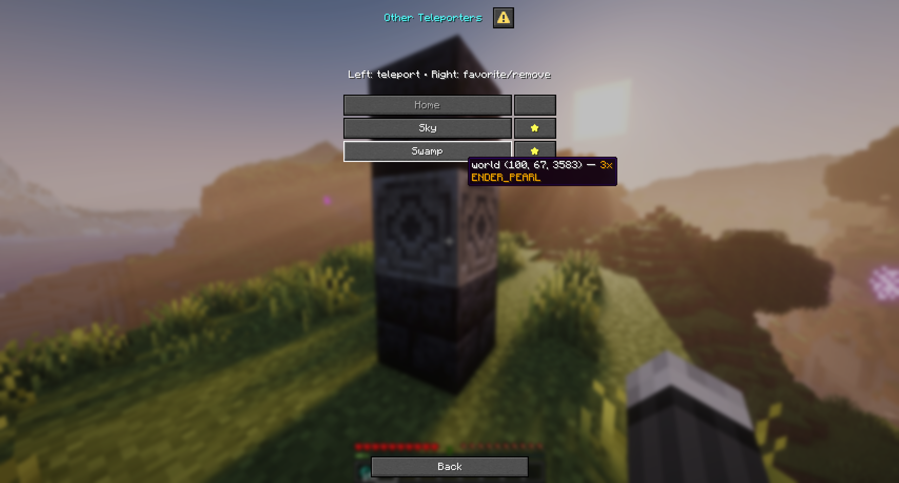
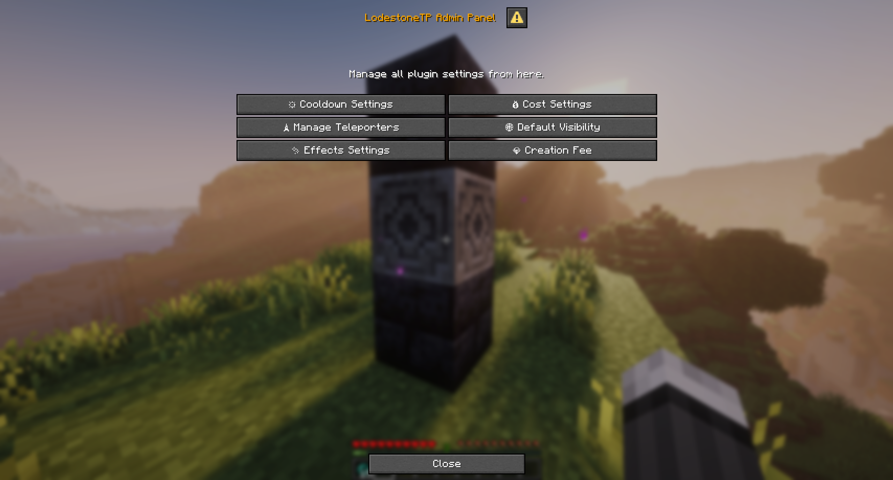

# LodestoneTP

 [](https://github.com/MBeggiato/LodestoneTP/actions/workflows/release.yml) [](https://discord.gg/9UUzdjpVPC)

See [CHANGELOG.md](CHANGELOG.md) for release history and notable changes.

## What Is LodestoneTP?

LodestoneTP is a survival-friendly Paper plugin that lets players create, manage, and use teleporters by building a simple multiblock structure around a Lodestone. The plugin focuses on native in-game dialogs, low-friction setup, and admin-friendly configuration without requiring external GUIs or complex commands.


## Core Features

- **Dialog-based UI** — uses Paper's native Dialog API instead of chest menus
- **Multiblock Teleporters** — create teleporters with Lodestone + Polished Blackstone Bricks
- **Structure Hologram Preview** — shows missing blocks for incomplete teleporters
- **Teleport Networks** — group teleporters into named networks with optional permission nodes
- **Favorites & Sorting** — mark favorite destinations and sort by alphabetical, distance, or most-used
- **Private/Public Access** — use visibility toggles and whitelist-based access control
- **Linked Teleporters** — create direct A↔B teleporter pairs
- **Warmup & Cooldowns** — optional teleport channeling and per-teleporter cooldown overrides
- **Flexible Costs** — support XP, item, and distance-based teleport costs
- **Creation Fees** — require items to create new teleporters
- **Effects & Atmosphere** — teleport particles, sounds, ambient effects, and light blocks
- **Custom Advancements** — progression-based advancement unlocks for discovery and usage
- **SQLite Persistence** — zero-config storage with automatic schema migrations

## How It Works

Build this structure:

```text
[Polished Blackstone Bricks]
[Lodestone]
[Polished Blackstone Bricks]
```

Then interact with the Lodestone to create or use a teleporter. If the structure is incomplete, the plugin can show a holographic build preview to guide the player.

## In-Game Hologram

To see a hologram preview of the actual structure, simply press Shift and left-click the Lodestone.


## Teleportation GUI



## In-Game Admin GUI

Using the in-game admin GUI, you can configure all settings directly in game.



## Documentation

- [CONFIGURATION.md](CONFIGURATION.md) — full config reference and example config
- [PERMISSIONS.md](PERMISSIONS.md) — command permissions and permission nodes
- [CHANGELOG.md](CHANGELOG.md) — release history

## Requirements

- Paper 1.21.11+
- Java 21+

## Build

```bash
./gradlew build
```

The jar is written to `build/libs/` and auto-deployed to `server/plugins/` if that directory exists.
