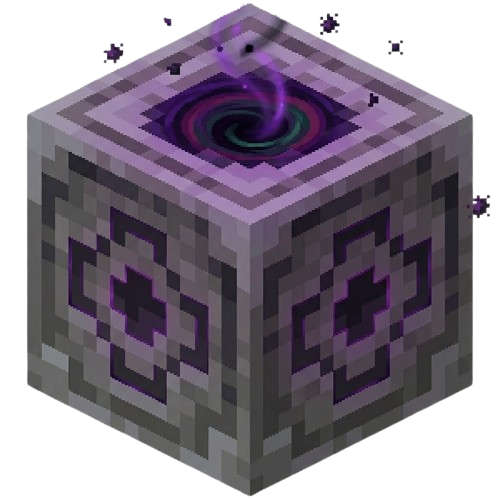

# LodestoneTP

 [](https://github.com/MBeggiato/LodestoneTP/actions/workflows/release.yml) [](https://discord.gg/9UUzdjpVPC)

See [CHANGELOG.md](CHANGELOG.md) for release history and notable changes.



_A Paper 1.21.11+ plugin that turns Lodestone blocks into a teleporter network using Minecraft's native Dialog UI._

## What Is LodestoneTP?

LodestoneTP is a **survival-friendly teleporter network plugin** that lets players and admins create, manage, and use teleporters by building simple **multiblock structures** (Lodestone + Blackstone Bricks). Everything is done through **in-game Dialog GUIs**.

### For Players

- **Create teleporters** by building the multiblock structure and right-clicking the Lodestone
- **Browse destinations** in a beautiful dialog menu with distance/cost preview
- **Favorite teleports** for quick access
- **Get teleported** with visual effects (particles, sounds) and optional warmup channeling
- **Earn advancements** for building and using teleporters

### For Admins

- **Configure everything in-game** via `/lodestonetp admin` (no config file editing)
- **Set costs** (flat XP, items, or distance-based tiers)
- **Manage access** with public/private status and per-player whitelists
- **Organize networks** to group teleporters by region/purpose with optional permission nodes
- **Customize effects** (particles, sounds, light blocks) with real-time intensity adjustments
- **Per-teleporter settings** (cooldown overrides, linking, network assignment)
- **All changes apply immediately** without server restart (async persistence with SQLite)

### Core Gameplay

Right-click any Lodestone in the multiblock structure to open a **teleport dialog**:

1. **See all accessible destinations** (with distance and cost)
2. **Mark favorites** for quick access
3. **Sort by distance, alphabetically, or most-used**
4. **Confirm the teleport** with a cost preview
5. **Wait through optional warmup** (glowing particle ring around you)
6. **Arrive** with departure/arrival effects

The plugin is **zero-config** — just drop the jar, restart, and start building teleporters. All management is in-game through dialogs, making it perfect for survival servers without overwhelming players.

## How It Works

_Build a **multiblock structure** to create a teleporter:_


```text
[Polished Blackstone Bricks]  ← top
[Lodestone]                   ← middle (right-click to interact)
[Polished Blackstone Bricks]  ← bottom
```

Right-click the Lodestone to interact. The plugin:

- **Auto-detects** structure validity when you interact
- **Auto-destroys** teleporters if the Lodestone or either Blackstone Brick is broken (even without interaction)

## Features

- **Dialog-based UI** — uses Paper's native Dialog API (no chest GUIs, pure in-game dialogs)
- **Multiblock Structure** — build with Lodestone + Polished Blackstone Bricks (auto-detects and destroys if structure breaks)
- **Naming & Destinations** — name teleporters (max 32 chars) and browse destinations with cost previews
- **Access Management** — toggle public/private status and manage a per-player whitelist for fine-grained access control
- **Teleporter Networks** — organize teleporters into named groups (via `/lodestonetp networks`) with optional per-network permission nodes
- **Favorites & Sorting** — mark favorite destinations and sort by alphabetical, distance, or most-used
- **Teleporter Linking** — create direct two-way teleport pairs (A↔B) with automatic linked teleport on interaction
- **Teleport Warmup / Channeling** — configurable pre-teleport delay with move-cancel detection and action bar countdown
  - Continuous rotating particle ring around player during warmup
  - Customizable intensity (low/normal/high)
  - Optional cancel sound and message
- **Per-Teleporter Cooldowns** — override global cooldown for individual teleporters (admin-configurable)
- **In-game Admin Panel** — complete GUI configuration via `/lodestonetp admin` (no config editing needed)
- **Flexible Costs** — charge flat XP levels, item consumption, or distance-based tiered costs
- **Creation Fees** — optional item cost (material + amount) to build new teleporters
- **Visual & Audio Effects** — enhanced particle effects
  - **Departure**: Portal particles + spiral effect around player
  - **Arrival**: Reverse portal + burst effect around player
  - **Ambient**: Continuous beacon hum and particles at teleporter locations
  - **Light Blocks**: Invisible LIGHT blocks above teleporters for visual indication
  - **Configurable Intensity**: scale particle effects (low/normal/high)
- **Custom Advancements** — 7 unique progression tasks and challenges
- **Directional Spawning** — players face the teleporter on arrival, offset 1.5 blocks forward
- **Async Teleportation** — safe, non-blocking teleport logic prevents server lag
- **SQLite Storage** — zero-config persistence with automated schema migrations (V1–V9+)

## Quick Start

1. **Build a Teleporter:**

```text
 [Polished Blackstone Bricks]
 [Lodestone]
 [Polished Blackstone Bricks]
```

Right-click the Lodestone to create a teleporter.

1. **Access Admin Panel:**
   - Command: `/lodestonetp admin`
   - Configure cooldowns, costs, effects, creation fees
   - All settings apply in-game (no config file edits needed)

2. **Organize with Networks (Optional):**
   - Command: `/lodestonetp networks`
   - Create named groups of teleporters
   - Set optional per-network permission nodes

3. **Reload Config:**
   - Command: `/lodestonetp reload`
   - Applies config changes and restores effects

**Permissions:**

- `lodestonetp.use` — use teleporters (default: everyone)
- `lodestonetp.create` — create new teleporters (default: OP)
- `lodestonetp.admin` — access admin panel (default: OP)
- OPs automatically bypass all restrictions

## Commands

| Command                 | Permission                    | Description                        |
| ----------------------- | ----------------------------- | ---------------------------------- |
| `/lodestonetp reload`   | `lodestonetp.admin` (or OP)   | Reload config and refresh effects  |
| `/lodestonetp admin`    | `lodestonetp.admin` (or OP)   | Open in-game admin panel           |
| `/lodestonetp networks` | `lodestonetp.manage_networks` | Manage teleporter networks (or OP) |

**Note:** OP players automatically bypass all permission checks. This ensures server admins always have access.

## Permissions

| Permission                     | Default  | Description                                                              |
| ------------------------------ | -------- | ------------------------------------------------------------------------ |
| `lodestonetp.use`              | Everyone | Use teleporters to travel                                                |
| `lodestonetp.create`           | OP       | Create new teleporters                                                   |
| `lodestonetp.manage_cooldowns` | OP       | Set per-teleporter cooldown overrides in admin panel                     |
| `lodestonetp.manage_networks`  | OP       | Create and manage teleporter networks                                    |
| `lodestonetp.network.bypass`   | OP       | Bypass per-network permission-node destination restrictions              |
| `lodestonetp.warmup.bypass`    | OP       | Bypass teleport warmup/channeling delay                                  |
| `lodestonetp.admin`            | OP       | Full access: bypass all restrictions, manage any teleporter, admin panel |

**OP Bypass:** Server operators (OP status) automatically bypass ALL permission checks and restrictions (cooldowns, costs, access gating, etc.). This applies even if a permission plugin explicitly denies the permission.

## Configuration

`plugins/LodestoneTP/config.yml` is generated on first run. All settings can be managed via the in-game admin panel.

```yaml
# ── Cooldown ───────────────────────────────────────────────
cooldown:
  enabled: true
  seconds: 10

# ── Warmup / Channeling ────────────────────────────────────
# Optional delay before teleport starts. Moving cancels warmup.
# Displays rotating particle ring around player + action bar countdown.
# Moves that are > 0.1 blocks trigger cancellation (allows head rotation).
warmup:
  enabled: true
  seconds: 3
  cancel-on-move: true
  bypass-permission: lodestonetp.warmup.bypass
  cancel-message: "Teleport canceled because you moved."
  cancel-sound: block.note_block.bass # Note: must be lowercase (e.g. block.note_block.bass, not BLOCK_NOTE_BLOCK_BASS)

# ── Teleport Cost ──────────────────────────────────────────
#
# type: xp_levels | item | distance
#
#   xp_levels  – flat XP-level cost every teleport
#   item       – consume a specific item from inventory
#   distance   – tiered cost based on block distance (or cross-world flat cost)
#
# distance sub-settings:
#   currency         – what to charge (xp_levels or item)
#   cross-world-cost – flat cost when destination is in another world
#   tiers            – list of {max-distance, cost} pairs, evaluated top-to-bottom
#                      use max-distance: -1 for "everything beyond"
#
cost:
  enabled: false
  type: xp_levels
  xp-levels: 3
  item:
    material: ENDER_PEARL
    amount: 1
  distance:
    currency: xp_levels
    cross-world-cost: 10
    tiers:
      - max-distance: 1000
        cost: 0
      - max-distance: 5000
        cost: 3
      - max-distance: -1
        cost: 8

# ── Defaults ───────────────────────────────────────────────
defaults:
  public: true # new teleporters start as public

# ── Effects ────────────────────────────────────────────────
#
# Master toggle for all visual/audio feedback.
# Individual toggles let you customize the experience.
#
# sounds          – teleport departure/arrival sounds (enderman teleport)
# particles.enabled – departure/arrival and warmup particles
# particles.intensity – scale particle counts: low (50%), normal (100%), high (150%)
#
# ambient – looping effects around every registered teleporter
#   enabled  – play ambient sound + particles
#   particles – show floating end_rod + reverse_portal
#   volume    – sound volume for beacon hum (0.0 – 1.0)
#   range     – block radius where players see/hear effects
#   interval-ticks – delay between ambient ticks (20 = 1 second)
#
# light – invisible LIGHT block placed above the teleporter structure (y+2)
#   enabled – place light blocks for ambient lighting
#   level   – brightness 0-15 (15 = glowstone)
#
effects:
  enabled: true
  sounds: true
  particles:
    enabled: true
    intensity: normal # low, normal, or high
  ambient:
    enabled: true
    particles: true
    volume: 0.4
    range: 8.0
    interval-ticks: 80
  light:
    enabled: true
    level: 10

# ── Creation Fee ───────────────────────────────────────────
#
# Optional item cost to build a new teleporter.
# The required items are consumed from the player's main hand.
# OPs and players with lodestonetp.admin bypass this cost.
#
creation-fee:
  enabled: true
  material: ENDER_PEARL
  amount: 1
```

Requires **JDK 21+** and **Gradle**.

```bash
./gradlew build
```

The jar is output to `build/libs/` and auto-deployed to `server/plugins/` if the directory exists.

## Requirements

- Paper 1.21.11+
- Java 21+

## Gameplay Tips & Best Practices

### Structure Safety

- **Teleporter structures are auto-destroyed if:**
  - The Lodestone is broken (directly or indirectly)
  - Either Polished Blackstone Brick is broken
  - The structure is incomplete when you interact
- **Tip:** Use a protected area or claim system if you want teleporters to be permanent

### Warmup Configuration

- `cancel-on-move: true` allows head rotation but cancels on any movement > 0.1 blocks
- Disable warmup by setting `warmup.seconds: 0` or `warmup.enabled: false`
- OPs and players with `lodestonetp.warmup.bypass` skip warmup entirely

### Particle Effects

- Use `effects.particles.intensity` to scale effects without disabling them
  - `low`: 50% particle count (performance-friendly)
  - `normal`: 100% (default, balanced)
  - `high`: 150% (very visual, more resource-intensive)
- Individual toggles (`effects.sounds`, `effects.particles.enabled`) let you customize experience

### Cost Configuration

- **Distance-based costs** are powerful for vanilla-friendly economies:
  - Local travel (0-1000 blocks): free
  - Regional travel (1001-5000 blocks): moderate cost
  - Cross-map travel (5001+ blocks): high cost
- **Cross-world costs** apply whenever destination is in different world (flat rate)
- OPs and `lodestonetp.admin` players bypass all costs

### Network Permissions

- Create networks to organize teleporters by region, difficulty, or purpose
- Optional permission nodes enforce access (e.g., `vip.skyblock_network`)
- Players with `lodestonetp.network.bypass` ignore permission restrictions

### Admin Management

- All configuration can be done in-game via `/lodestonetp admin` (chat commands not required)
- Changes apply immediately on `/lodestonetp reload`
- No downtime for config changes (async persistence)

## Troubleshooting

### "I'm OP but can't access the admin panel"

- Ensure `lodestonetp.admin` permission is not explicitly denied in your permission plugin
- OPs automatically bypass permission checks, but some permission managers require explicit grants
- Try `/lodestonetp admin` — should work if you're OP

### "Teleporter still shows after structure is destroyed"

- Teleporter might be in a loaded/cached location
- Run `/lodestonetp reload` to force refresh
- Check server logs for errors during destruction

### "Particles/sounds not showing"

- Verify `effects.enabled: true` and `effects.particles.enabled: true` in config
- Check client particle settings (Options → Video Settings → Particles)
- Increase `effects.particles.intensity` if set to `low`

### "Warmup cancels immediately"

- `cancel-on-move` is enabled; standing still is required
- Crouching, jumping, or any movement > 0.1 blocks triggers cancellation
- Set `warmup.seconds: 0` to disable warmup
